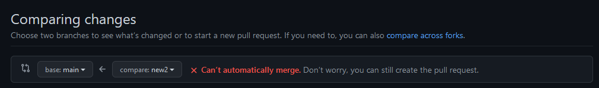
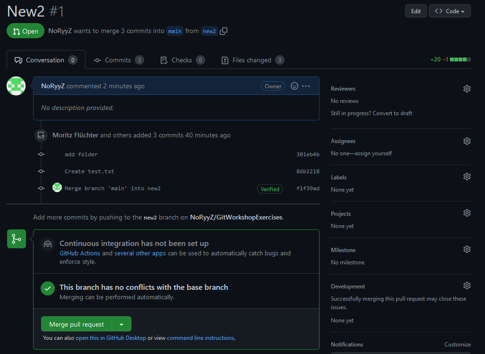
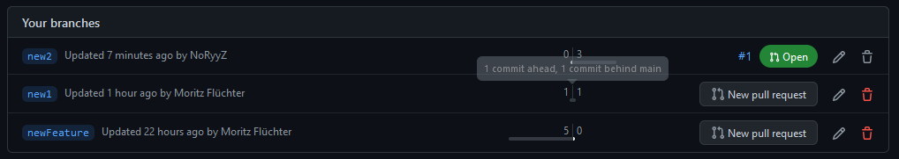

# Managing Branches

## Introduction

The last exercise, you learned how to create and merge branches.
Remember, that branches only separate a state of development and always contain the entire project.
Branches need to be synchronized with each other from time to time in order to include important changes done to a different branch.

Let's say, for example, you have two branches for two different features.
If your group partner find a critical bug and fixes it in his branch, you may want to apply the same changes to your branch as well.
While it is possible to manually copy the fix, git provides multiple tools to simplify this process

## (Optional) Resources for more information

Cherry pick: https://www.atlassian.com/git/tutorials/cherry-pick

## Setup

For this exercise, you can work alone.
You first need to create two branches that will be used in this exercise (choose the names as you want) and push them to the repository.

## Git Cherry pick

When cherry-picking, you apply a **single** commit from another branch to your current branch.
This is important if you want to synchronize single changes.
Remember, that Branches do not always need to be merged back with the original master and can be an independent development branch.
So if you do not want to merge the entire branch and unwanted changes, cherry-pick is your best option.

First, generate a commit for one of the branches your created (lets call that branch A).
Note the commits hash (commit ID) and swap to the other branch (lets call that one B).

To synchronize the commit, use

> git cherry-pick -x [commit ID]

This will apply the chosen commit to your repository.
Check the local files and see whether the commit was indeed applied to your repository.
When using git status, you can see that the changes are already part of a commit.
Then, push the new commit back to the remote repository.

When using git log, you can see that git automatically added a cherry pick reference and the origin commit hash.
This provides an important reference for future work with the branch and is why you should always use the -x flag.

If you want, you can also take a look at the commit via GitHub.
Go to [Repo URL]/commits and select the correct branch.
GitHub automatically adds a hyperlink to the referenced commit ID.

## Merging Branches

In the last exercise, you learned how to merge a branch back into the main branch.
Remember, that the branch still exists after that.
So rather than merging the entire branch into main, you rather 'synchronized' their state.

When the main branch is extended via e.g. bug fixes, new features, you may want to have these changes in your development branches as well.
Merging the main branch into another branch is just as possible as the other way around.
Of course, you need to be careful if similar files were changed.

Swap back to the main branch, change some file (e.g. the README), commit and push the change.
While you could also cherry-pick this singular commit, use git merge for this one.
Swap to your created branch A and use (use master instead of main if that is the name of your default branch)

> git merge main

## Pull Requests

In the last exercise, I already touched the topic of managing access to the main branch.
It makes sense to always add an extra layer of security when applying changes to this or other important branches.
The basic idea of a pull request is requesting a merge into a specific branch which can then be reviewed and approved/denied by some other maintainer.

Another common example are open-source repositories.
To prevent random commits and a generation of unnecessary branches, you can fork the entire project, add your changes and then create a pull request for the original repository.

Git itself does not implement restrictions to push changes, merge branches, ... .
These features are implemented on the repository server e.g. GitHub.

The goal of this part is to create a pull request for one of your branches.
First, add some changes to branch B, commit and push them.
Go to GitHub.com and open your forked GitWorkshopExercises repository.

To create a pull request, use the tab 'Pull request' and click on 'new pull request'.
You should now be able to choose the source and destination branch:

Base is the branch the changes will be applied to and compare the change's origin.
GitHub will automatically show the differing commits and changes.
It may also tell you that an automatic merge isn't possible due to a merge conflict.

To create the pull request, click 'create pull request'.
GitHub will then allow you to specify a title and description for the pull request.
Normally, Reviewers and Assignees would be filled automatically, but we did not setup access control.
Finalize the request vie 'create pull request'.

When reviewing the new pull request, you can see that GitHub automatically checks for merge conflicts.
If there are any, you can perform them via the webinterface.

If there aren't any or you solved them already, you can merge the pull request.
The pull request will stay open, until you add a comment and close it manually!

## Branches being ahead and behind

Now that you've worked a lot with branches, you know that commits can be made independently to them.

If you want to see the differences between branches, it is best to use GitHub or a GUI tool.
They allow you to check the differences in commits rather than just looking at the files.

A common metric is the x ahead/behind main commits metric.
It tells you how many commits have been made to the default (main) branch (behind main count) and how many commits have been made to the inspected branch (ahead main count).
Obviously, both can be larger than zero.
It is also worth mentioning, that when merging the main branch into your considered branch, the behind main count is set back to 0.

Check these statistics via [REPO URL]/branches on GitHub.
Take a look at the overwview:

## Summary

When using multiple branches, you have to cherry-pick and merge from time to time.
The goal is to keep all branches up-to-date.
Obviously, the more branches there are, the more complicated to manage this process gets.
That's why GUIs and Webinterfaces are your best friends for managing branches.
